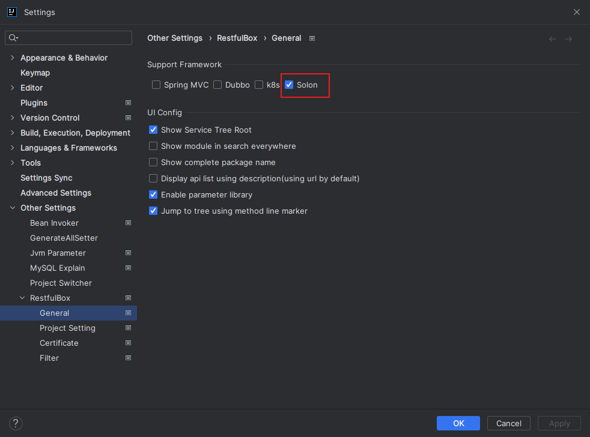
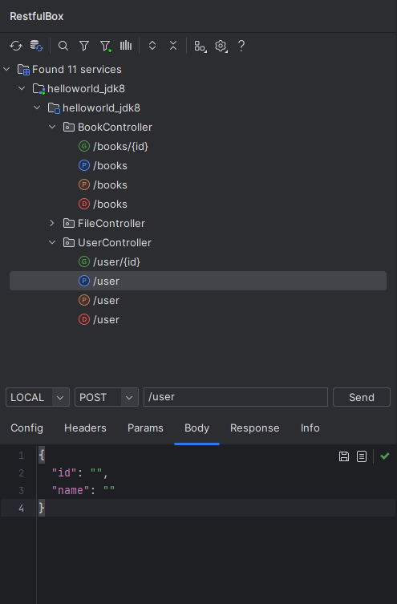
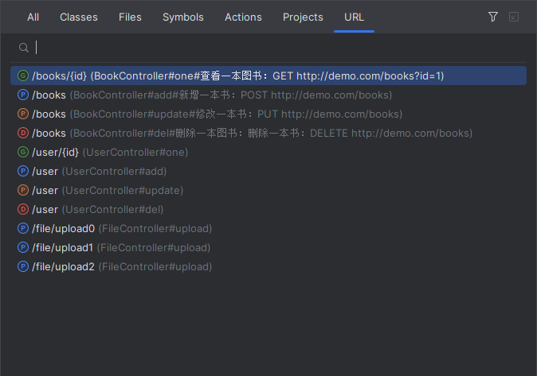
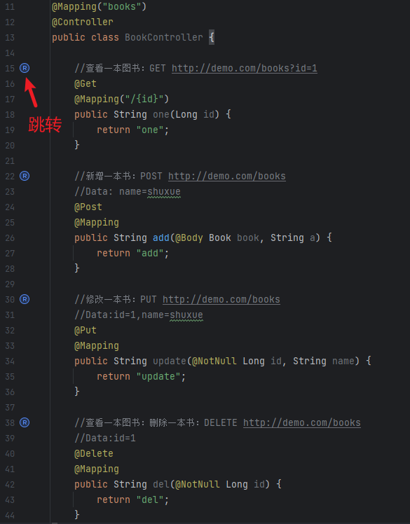

# RestfulBox-Solon

[简体中文](./README.zh_CN.md)

[RestfulBox-Solon](https://plugins.jetbrains.com/plugin/21848-solon) is a plugin that support Solon scanning and request for [RestfulBox](https://plugins.jetbrains.com/plugin/14723-restkit) plugin from version 2.0.0.

> Note  
> RestfulBox plugin has provided extension point from version 2.0.0. You can also support your web framework restful apis like this plugin.

If this plugin helps, please **🌟Star**! If you have any good idea, please let me know.

## Features
- Support most RestfulBox features.
- Support scanning solon apis in java project.
- Support sending http request.
- Support jumping to tree in the solon method from apis impl.

## Install

Firstly install `RestfulBox` plugin in Idea online. Then install RestfulBox-Solon.

- **Using IDEA plugin system**

Recommended <kbd>Preferences(Settings)</kbd> > <kbd>Plugins</kbd> > <kbd>Browse repositories...</kbd> > <kbd>find "Solon"</kbd> > <kbd>Install Plugins</kbd>

- **Local install**

Download `distributions/RestfulBox-Solon-x.x.x.zip` and install in idea.

## Usage
After installed this plugin, you should enable it in `RestfulBox` setting. Refresh in `RestfulBox` window.

You will see.

Search:

Jump from code:

More introduction:
https://github.com/newhoo/RESTKit/blob/main/doc/en/README.md

## Sponsor
You can take me a cup of coffee as you want. Thanks!

