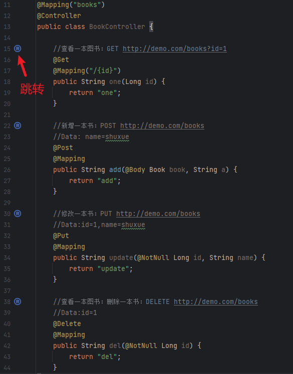

# RestfulBox-Solon

[RestfulBox-Solon](https://plugins.jetbrains.com/plugin/21848-solon) 是一个依赖于[RestfulBox](https://plugins.jetbrains.com/plugin/14723-restkit) 插件的插件，用于为`RestfulBox`(2.0.0开始) 提供Dubbo支持。

> 注意  
> RestfulBox 从2.0.0开始提供了扩展点，如同本插件，你也能为 RestfulBox 提供自己所需的接口扫描方式。

如果你觉得本插件不错，请给个🌟Star吧，同时也欢迎提供宝贵的建议。

## 功能
- 支持RestfulBox的绝大多数功能。
- 支持扫描Java项目中的Solon接口。
- 支持发送http请求。
- 支持在Solon接口实现方法上跳转到service tree窗口。

## 安装
- **插件市场安装**

推荐 <kbd>Preferences(Settings)</kbd> > <kbd>Plugins</kbd> > <kbd>Browse repositories...</kbd> > <kbd>输入"Solon"</kbd> > <kbd>点击Install</kbd>

依赖插件`RestfulBox`亦需安装

## 使用
安装完成后，在`RestfulBox`插件设置中启用Solon，然后在`RestfulBox`窗口刷新项目接口。

如下图：

搜索：

源码跳转接口：

更多说明：
https://github.com/newhoo/RESTKit/blob/main/doc/zh_CN/%E7%9B%AE%E5%BD%95.md

## 支持作者
你的支持是鼓励我前行的动力，非常感谢~

